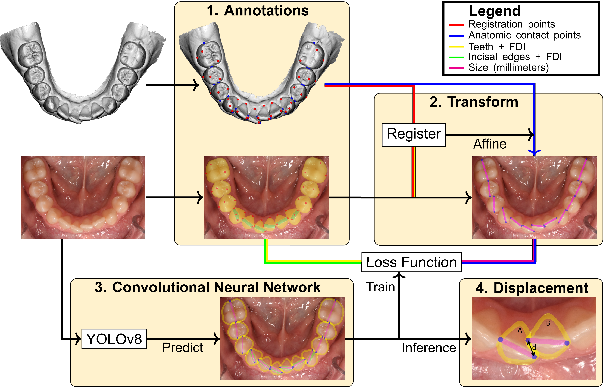

# Automated tooth crowding analysis
Deep learning to determine Little Irregularity Index on occlusal intra-oral photographs

## Method



The method was developed with keypoint annotations on intra-oral scans and corresponding intra-oral photographs. The anatomic contact points were registered from the scan to the photo and YOLOv8 was used to determine tooth objects. Each tooth was predicted with a segmentation of its boundary, the mesial and distal anatomic contact points, and the physical size of the tooth in millimeters.

## Installation

Install a Conda environment:

``` bash
conda create -n crowding python=3.11
conda activate crowding
```

Install the Pip requirements:

``` bash
pip install -r requirements.txt
```

Install Ultralytics YOLOv8

``` bash
pip install -e ultralytics
```

## Inference

You can run inference on the photograph in the figure above by running `infer.py`. Measurements of the anterior teeth will be saved to '*measurements.xlsx*'. The model predictions can be visualized by running `infer.py --verbose`. Furthermore, the model can be run on your own photographs by specifying a folder with images using the `in_dir` argument.


## Citation

``` bib
@article{crowding_ai,
  author={Gabriel Hertig, Niels van Nistelrooij, Jan Schols, Tong Xi, Raphael Patcas, Shankeeth Vinayahalingam},
  year={2025},
  title={Quantitative Tooth Crowding Analysis in Occlusal Intra-Oral Photographs using a Convolutional Neural Network},
  note={Submitted to European Journal of Orthodontics},  
}
```
